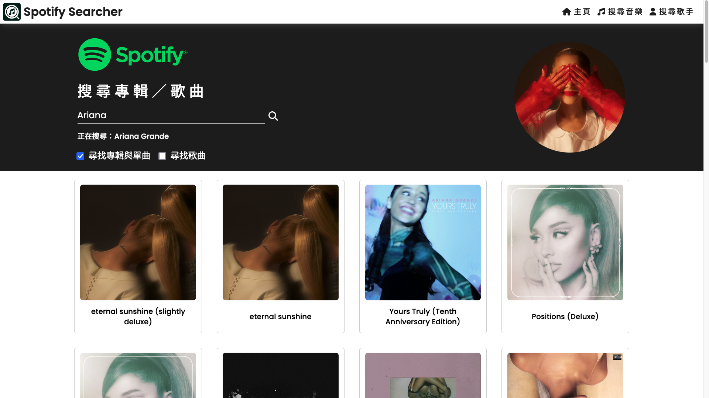
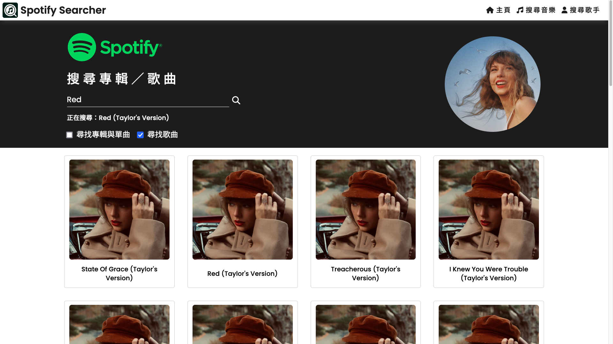
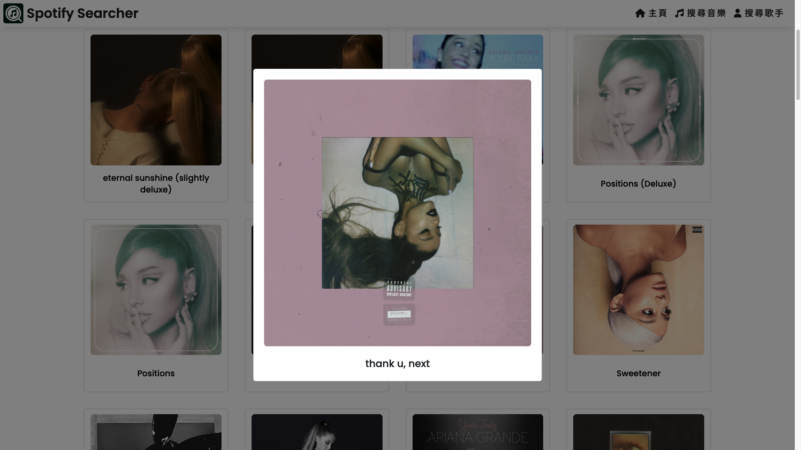
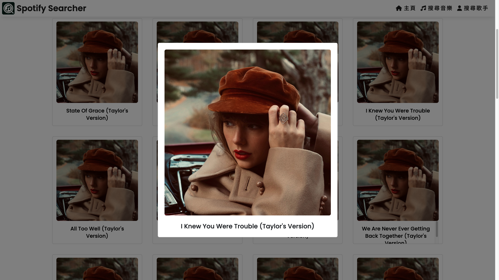
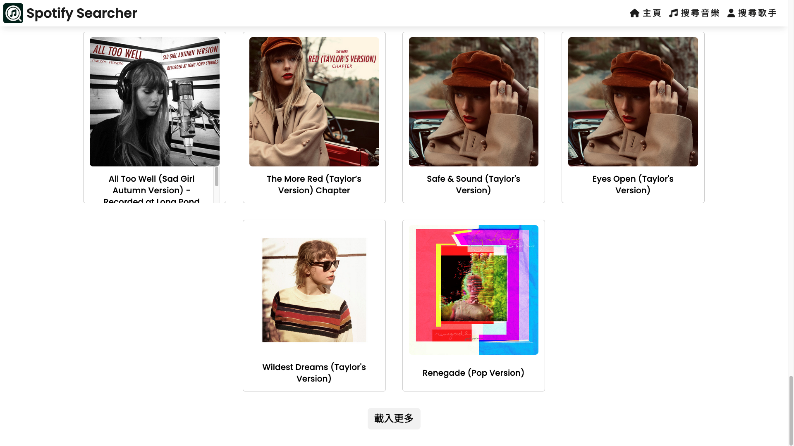
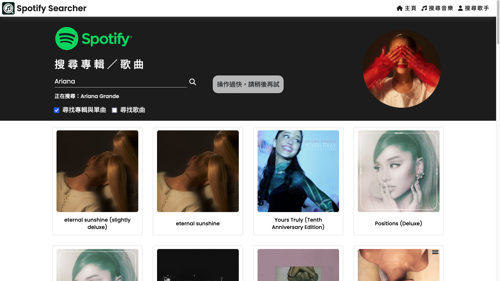
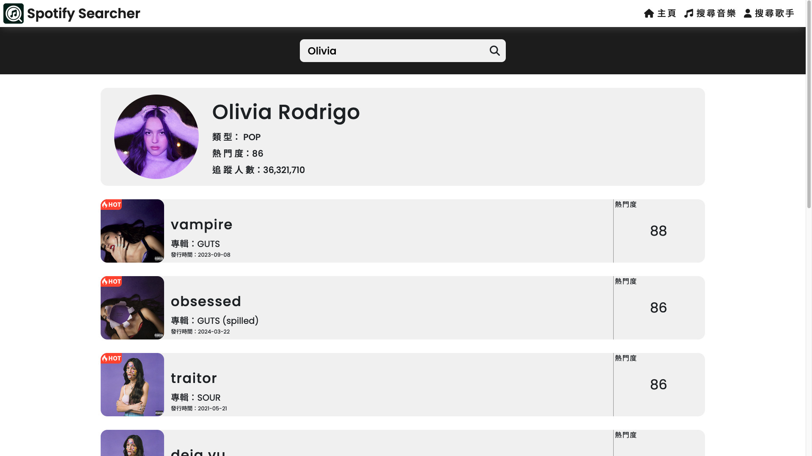
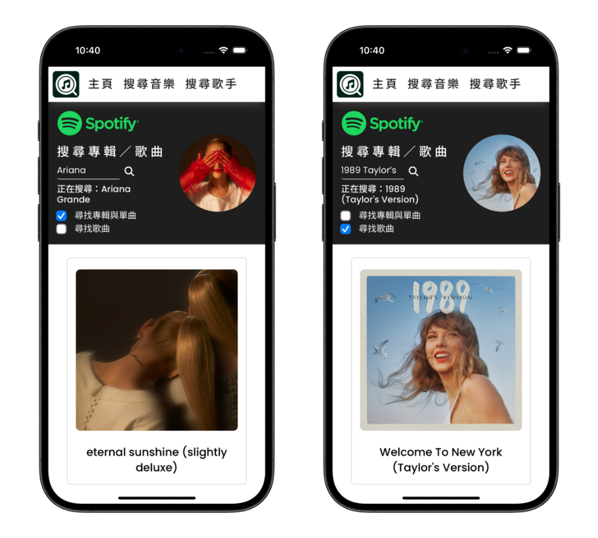

# Spotify 搜尋網站 🎵

此專案於 2024 年 3 月製作

「Spotify 搜尋網站」透過 Spotify API，提供使用者搜尋歌曲、專輯及歌手資訊等，並搭配易於使用的介面，讓使用者能夠快速找到自己喜歡的音樂。

## 專案截圖 🖥

### 首頁

### 專輯搜尋

### 歌曲搜尋

### 音樂詳情

### 更多按鈕

### 提示訊息

### 歌手資訊

### 響應式設計

## 使用技術 🔧

- **JavaScript**：負責邏輯撰寫

- **React**：建立前端使用者介面，並透過 React Hook 管理狀態及 React Router 處理路由

- **React Bootstrap**：在專輯和單曲頁面使用 React Bootstrap 所提供的 Container 與 Card 進行排版

- **SCSS**：使用 SCSS 預處理器進行樣式設計及響應式設計

- **Spotify API**：串接 Spotify API 取得歌曲、專輯、歌手等資訊

## 功能 🚀

- **簡易搜尋**：能直接透過關鍵字搜尋歌手、專輯，無需輸入完整名稱

- **音樂資訊**：查詢歌手所有專輯與單曲，以及特定專輯內所有曲目

- **詳細資訊**：點擊專輯或單曲，可放大查看專輯、單曲圖片及名稱

- **歌手資訊**：查詢歌手基本資訊，包含圖片、簡介及近期前 10 名熱門歌曲

- **搜尋限制**：透過臨時訊息提醒使用者在特定時間內僅能搜尋一次，避免過度使用 API

## 執行方式 🏃

1. `git clone` 此專案至本機

2. `cd` 進入專案資料夾

3. `npm install` 安裝相關套件

4. 編譯 `SCSS` 檔案

5. 放入 `Spotify API` 金鑰

6. `npm start` 開啟專案
